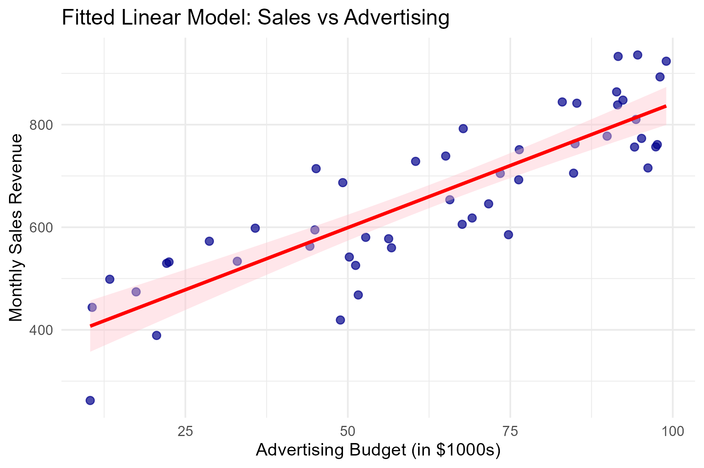
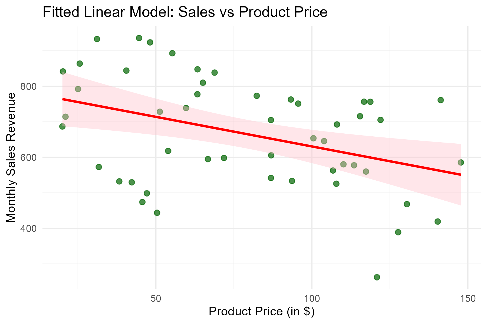

# Ethiopian Market Analysis: Regression Modeling with Bootstrap Simulation

This project demonstrates how to leverage **Bootstrap Simulation** combined with Multiple Linear Regression to derive highly reliable business insights. I predict **Monthly Sales Revenue** based on two key drivers: **Advertising Budget** and **Product Price**.

🚀 **[Click here to view the full HTML Project Report](https://htmlpreview.github.io/?https://github.com/surafelasfawosen/ethiopian-market-bootstrap-analysis/blob/main/Project_Report.html)**

## 🎯 The Core Point: Why Use Bootstrap in Business Analysis?

In standard business analytics, we often rely on Ordinary Least Squares (OLS) regression to understand how factors like ad spend or pricing affect sales. However, standard regression relies on strict mathematical assumptions (perfect normality, constant variance, no severe outliers). In the real world, especially with small datasets (like our n = 50 companies), these assumptions are rarely met perfectly.

**The Solution:** Instead of trusting a single model run, we use **Bootstrap Resampling**. We simulate taking 10,000 different samples from our original data and run 10,000 regression models. 

### How It Helps Business Analysis:
1. **Robustness Without Strict Assumptions:** It provides accurate confidence intervals without requiring perfectly normal data.
2. **Reliable Risk Bounds:** Decision-makers don't just want a single "average" estimate; they want to know the "worst-case" and "best-case" ROI. Bootstrap mathematically bounds this risk.
3. **Data-Driven Confidence:** It proves the stability of our findings, which is critical when allocating millions of dollars in advertising or setting competitive pricing.

### Scenarios Where Bootstrapping is Essential:
- **Small Sample Sizes:** When evaluating a pilot program across only 30-50 stores.
- **Financial Risk Modeling:** When standard error estimates must be extremely accurate to avoid financial loss.
- **Non-Normal Data:** When dealing with skewed data (e.g., customer lifetime value) where standard models fail.

---

## 📊 Results & Interpretation

Our base dataset contains 50 records. Initial descriptive statistics show:
- **Average Monthly Sales:** $666.48
- **Sales Standard Deviation:** $153.80

### 1. The Effect of Advertising (Positive Driver)
*For every additional $1,000 spent on advertising, how much do sales increase?*




**Interpretation:**
The standard model estimated a ~$4.98 return. After running 10,000 bootstrap simulations, our **95% Confidence Interval is (4.618, 5.325)**. 
**Business Insight:** We can tell stakeholders with 95% certainty that every additional $1,000 invested in advertising will consistently generate between **$4,618** and **$5,325** in new monthly sales. This proves advertising is a highly stable and profitable investment.

### 2. The Effect of Product Price (Negative Driver)
*How much do sales drop when we increase our product price by $1?*




**Interpretation:**
Our bootstrap simulation generated a **95% Confidence Interval of (-2.136, -1.596)** for the price coefficient.
**Business Insight:** Increasing the product price by $1 will reliably decrease overall monthly sales volume by between **$1,596** and **$2,136**. This allows the pricing strategy team to calculate the exact price elasticity and determine if a price hike is worth the associated volume loss.

---

> 💡 **A Note for Researchers & Business Analysts:**  
> Are you struggling with a lack of data? Do you have a dataset with fewer than 100 records and worry your findings won't be statistically significant? **Don't let a small dataset stop your analysis.** By implementing the Bootstrap model demonstrated in this repository, you can simulate thousands of scenarios from your small sample, extracting powerful, statistically sound business insights. I built this specific repository so you can try it yourself—feel free to clone this code, replace the data with your own, and see the magic of bootstrapping!

## 🛠️ How to Clone and Run the Code Yourself

If you'd like to try running the R code and generate the bootstrap simulation yourself, follow these steps:

1. **Clone the repository to your local machine:**
   ```bash
   git clone https://github.com/surafelasfawosen/ethiopian-market-bootstrap-analysis.git
   cd ethiopian-market-bootstrap-analysis
   ```

2. **Prerequisites:** Ensure you have `R` installed, along with the `ggplot2` and `boot` packages. You can install them in R using:
   ```R
   install.packages(c("ggplot2", "boot"))
   ```

3. **Run the script:**
   ```bash
   Rscript bootstrap_regression.R
   ```

4. **Check the output:** The console will display the exact confidence intervals, and the generated `.png` plots will be automatically saved in the `images/` folder!
